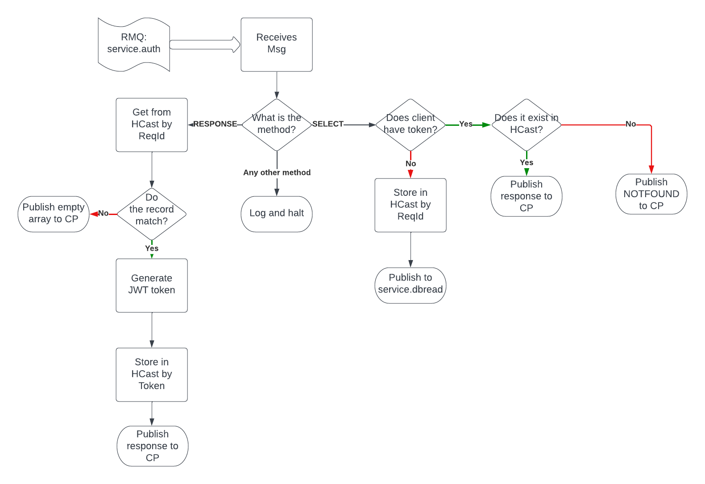

# DAPEX Authentication Service/Orchestor

It listens on RMQ "service.auth" queue and authenticates customers logging in to the system.

## Overview
The flowchart below gives an overview of what this service does:



## Step 1 - Customer Authentication
It receives a DAPEX message that contains the following structure with dummy data:
```json
{
  "endpoint": {
    "resource": "service.auth",
    "method": "select"
  },
  "client": {
    "clientId": "app-1",
    "requestId": "app1-r-1"
  },
  "originator": {
    "clientId": "app-1",
    "requestId": "app1-r-1",
    "endpoint": "auth"
  },
  "criteria": [
    {
      "field": "username",
      "value": "user@test.com",
      "operator": "EQ"
    },
    {
      "field": "password",
      "value": "password1234",
      "operator": "EQ"
    }
  ]
}
```
## Step 2 - Sends the request to database Read-Only service
It will send the DAPEX messge onto the database server updating the rmqClient and endpoint:

```json
{
  "endpoint": {
    "resource": "service.dbread",
    "method": "select"
  },
  "client": {
    "clientId": "service.auth",
    "requestId": "app-1-app1-r-1"
  },
  "originator": {
    "clientId": "app-1",
    "requestId": "app1-r-1",
    "endpoint": "auth"
  },
  "criteria": [
    {
      "field": "username",
      "value": "user@test.com",
      "operator": "EQ"
    },
    {
      "field": "password",
      "value": "password1234",
      "operator": "EQ"
    }
  ]
}
```

### Security Consideration
In order to avoid sending unencrypted passwords through the system, the service could remove the password from the DAPEX
message before sending it on. However, it will need to store this in the local cache so that it can recall the original
message.

## Step 3 - Receives a response from the Database service
The database service will search for the customer and return a response:
```json
{
  "endpoint": {
    "resource": "service.auth",
    "method": "response"
  },
  "client": {
    "clientId": "service.dbread",
    "requestId": "app-1-app1-r-1"
  },
  "originator": {
    "clientId": "app-1",
    "requestId": "app1-r-1",
    "endpoint": "auth"
  },
  "criteria": [
    {
      "field": "username",
      "value": "user@test.com",
      "operator": "EQ"
    },
    {
      "field": "password",
      "value": "password1234",
      "operator": "EQ"
    }
  ],
  "response": {
    "status": "ok",
    "message": "",
    "data": [
      {
        "field": "customerId",
        "value": "1"
      },
      {
        "field": "firstname",
        "value": "John"
      },
      {
        "field": "surname",
        "value": "Smith"
      },
      {
        "field": "email",
        "value": "user@test.com"
      },
      {
        "field": "password",
        "value": "==aeacls1ktyaysb"
      }
    ]
  }
}
```
If no matching customer is found, then in the data response, it will be an empty arrary.

## Step 4 - Validates the customer and sends the response to Collection Point
It will check the password for matching and sends the response to the collection point service:
```json
{
  "endpoint": {
    "resource": "service.collection",
    "method": "response"
  },
  "client": {
    "clientId": "service.auth",
    "requestId": "app-1-app1-r-1"
  },
  "originator": {
    "clientId": "app-1",
    "requestId": "app1-r-1",
    "endpoint": "auth"
  },
  "response": {
    "status": "ok",
    "message": "authen",
    "data": [
      {
        "field": "customerId",
        "value": "1"
      },
      {
        "field": "firstname",
        "value": "John"
      },
      {
        "field": "surname",
        "value": "Smith"
      },
      {
        "field": "securityToken",
        "value": "123456ertyu"
      }
    ]
  }
}
```
If, either the password does not match, or if the data was an empty array, then it will respond with an empty data array.

## Step 5 - Send response to rmqClient
The collection point will:
1. Receive responses and store them in the local cache
2. Receives request and checks if there is a matching message in the local cache. If there is, then it will send out the following message:

```json
{
  "endpoint": {
    "resource": "auth",
    "method": "response"
  },
  "client": {
    "clientId": "service.collection",
    "requestId": "app-1-app1-r-1"
  },
  "originator": {
    "clientId": "app-1",
    "requestId": "app1-r-1",
    "endpoint": "auth"
  },
  "response": {
    "status": "ok",
    "message": "authen",
    "data": [
      {
        "field": "customerId",
        "value": "1"
      },
      {
        "field": "firstname",
        "value": "John"
      },
      {
        "field": "surname",
        "value": "Smith"
      },
      {
        "field": "securityToken",
        "value": "123456ertyu"
      }
    ]
  }
}
```
3. If there are no matching messages in the cache, it will send out a response with "NOTFOUND" - the rmqClient will continue to resend the request.

